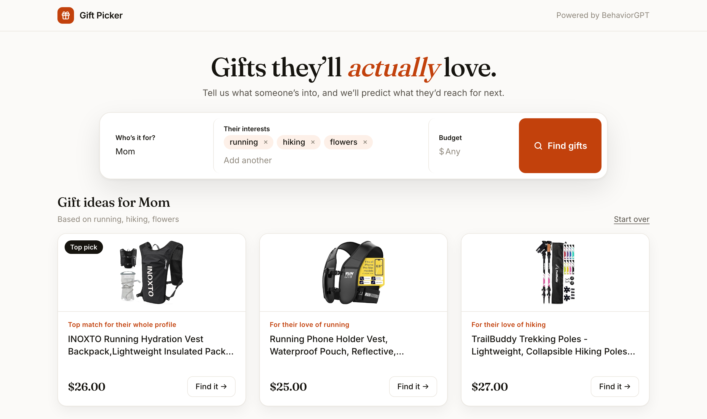

# Gift Picker

Tell it what someone loves ("running, hiking, flowers"), or paste their Pinterest profile, and get three gift ideas picked by [BehaviorGPT](https://github.com/Unbox-AI/behaviorgpt). The interests are played to the model as a short shopping session, and the model predicts what that person would reach for next. Save the ideas you like to get more like them, then share a shortlist so others can vote.

Every recommendation comes from BehaviorGPT. There is no LLM in the loop.



It is a small, complete example of building on the BehaviorGPT SDK: no catalog to upload, no user data. Just a synthetic history, recommendations and personalized search against one of the pre-embedded catalogs.

> Status: working prototype. It runs against the pre-embedded `retail_catalog`, so gift quality depends on what that catalog carries.

## What it shows

| In the app | BehaviorGPT call |
|---|---|
| Choosing the best wording for an interest | `client.complete(history=[Search(q)])` on a few phrasings, keeping the highest score |
| Turning interests into a profile | `Search` + `View` events, one pair per interest |
| "Top match for their whole profile" | `complete` with the profile, ending on a `View` (recommendations) |
| "For their love of …" | `complete` with the profile plus a final `Search` (personalized search) |
| Pinterest import | each recent pin's title becomes a `Search` + `View` pair, newest pins last |
| Occasion and recipient | the per-interest search says it: `Search("golf birthday gift for dad")` |
| ♥ Save, more like this | `View` + `AddToCart` of the saved product appended to the profile |
| ✕ Not for them | same call, with that product and its category excluded |

## Run it

Needs Python 3.11+, [uv](https://github.com/astral-sh/uv) and a BehaviorGPT API key from [unboxai.com/behaviorgpt](https://unboxai.com/behaviorgpt).

```sh
git clone https://github.com/Jenspalmborg/behaviorgpt-gift-picker.git
cd behaviorgpt-gift-picker
uv sync
cp .env.example .env                # paste your key as UNBOXAI_API_KEY
uv run uvicorn app:app --reload
```

Open http://127.0.0.1:8000. Links like `/?for=Mom&interests=running,hiking,flowers&budget=50&occasion=birthday` (or `/?for=Jane&pinterest=jane/cozy-home`) fill in the form and run the search, which is handy for sharing examples.

Shared shortlists are stored in SQLite at `data/gift-picker.db`; set `GIFT_DB` to put it elsewhere.

## How it works

1. **Pick the wording.** Broad words land badly on their own: in this catalog "video games" returns Nike sneakers and "gold jewelry" returns coffee. So each interest is searched as `X`, `X gift` and `X accessories`, and the phrasing whose top result the model is most confident about wins. If even the best score is below `MIN_MATCH_SCORE`, the interest is skipped and the page says so.
2. **Build a pretend session.** Each interest becomes a `Search` followed by a `View` of its top product, all in one session:
   ```
   Search("running …")  → View(top running product)
   Search("hiking …")   → View(top hiking product)
   Search("flowers …")  → View(top flowers product)
   ```
   The views matter: they tell the model which kind of product in each area this person looked at, not just the words.
3. **Ask for picks.** The top pick comes from the session as is ("what would they want next?"). The other two add one more `Search` for a single interest at the end, so the results are ranked for someone who also likes everything else.
4. **Keep them different.** Picks skip the products already "viewed" in the session, anything over budget, and items too close to an earlier pick (same leaf category or same first words of the title).
5. **Refine.** Saving a card adds `View` + `AddToCart` of it at the end of the session. The model leans hard on the latest events (one saved kettle turns every result into kettles), so only that card's slot follows the saves, as "More like what you saved"; the others stay tied to one interest each. ✕ replaces a card from the same interest, avoiding its category. "Show me others" asks again while excluding everything already shown.

**Pinterest.** Public profiles and boards have RSS feeds (`/<user>/feed.rss`, `/<user>/<board>.rss`), so no login or API key is needed. Many personal pins have no caption; for those the title of the pin's own page is used ("Diy dinosaur play house | Dinosaur dollhouse, …"). Pin titles are searched as written. With an occasion set, the last card searches the occasion alone ("housewarming gift"), still personalized by the pins, because phrases like "Barnerom diy housewarming gift" find nonsense.

**Occasion, recipient and age.** The recipient is read from "Who's it for?": "my boyfriend", "Pappa" or "Anna (sister)" give "boyfriend", "dad" and "sister", while a plain name gives nothing. These shape the search wording: "birthday gift for dad" on its own returns generic gift-shop items, but "golf birthday gift for dad" returns golf gifts. A child's age wins over the relationship ("gift for kids").

For a baby or a kid, age is also a filter, since the catalog has no age field: a pick must be in a children's category (Baby Products, Toys & Games, Children's Books, …) or say so in its name ("toddler", "6 months", "for kids"). If nothing they like passes, the cards fall back to general ideas for that age and the page says so. Teens shop from the same categories as adults, so for them only the wording changes.

**Prices.** The catalog stores prices of $1,000 and up as only their thousands digit (a MacBook is `"1"`), so prices under $10 are treated as unknown, and with a budget set, items without a trusted price are left out.

The name is only used for the heading. The SDK's `Domains` has `age_group` and `gender`, but they're set once per client and their values aren't documented, so they aren't used yet.

## Layout

```
app.py              FastAPI backend: builds the history, calls BehaviorGPT, picks gifts
pinterest.py        reads recent pins from a public Pinterest profile or board
lists.py            shareable shortlists and votes (SQLite)
static/index.html   the main page (plain HTML, CSS and JS, no build step)
static/list.html    the shared shortlist page at /list/<id>
docs/screenshots/   README images
```

`GIFT_CATALOG_ID` and `GIFT_MARKET` in `.env` switch to another catalog or market.

## Known limits

- The retail catalog is patchy: some interests need more specific wording ("gaming headset" rather than "video games").
- Three slots and one top pick means a third interest can get squeezed out.
- Near-duplicates from different sellers (two V-Bucks cards) can still slip through.
- Pins about recipes or articles map to groceries or unrelated products; boards of things work much better than boards of ideas. Pins in other languages match less well against the English catalog.
- Items over $10,000 can still slip under a budget (a Rolex stored as `"19"`), until the catalog's prices are fixed.
- "Find it" links straight to the Amazon product, since catalog ids are `pa` + the ASIN; other ids fall back to an Amazon search.
- Votes on shared lists aren't tied to accounts: one per browser, easy to game.

## License

MIT. Product data and images come from the BehaviorGPT pre-embedded catalog.
